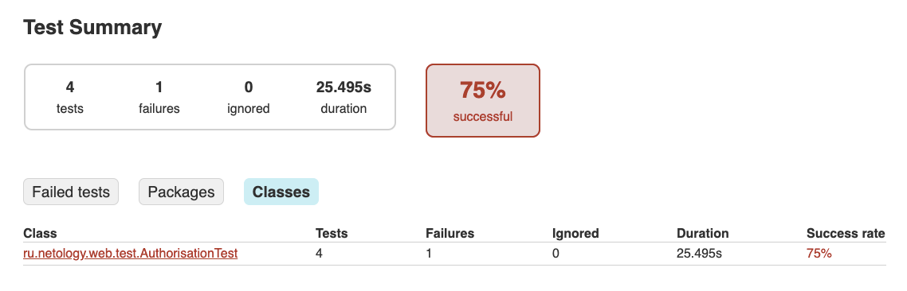

## Autotests_Docker_mySQL

**Autotest for checking the registration form**

**Tools:**
* IntelliJ IDE (Gradle)
* Java 11
* JUnit
* Docker-compose
* mySQL
* Selenide

## How to use

* Clone the repo and build it yourself.

* Download [Docker Desktop](https://www.docker.com/products/docker-desktop) for Mac or Windows. [Docker Compose](https://docs.docker.com/compose) will be automatically installed. On Linux, make sure you have the latest version of [Compose](https://docs.docker.com/compose/install/).
Create Docker Container on base MySQL. 

**docker-compose.yml.:**

```
mysql:
image: mysql:8.0
ports:
- '3306:3306'
volumes:
- ./databases/schema.sql:/docker-entrypoint-initdb.d/schema.sql
environment:
- MYSQL_RANDOM_ROOT_PASSWORD=yes
- MYSQL_DATABASE=...
- MYSQL_USER=...
- MYSQL_PASSWORD=...
```
Run in this directory:
```
docker-compose up
```


**Run the `.jar` file:**
```
java -jar app-deadline.jar
```
The server should start and you'll see something like:

~~~~~~~~
INFO  Application - No ktor.deployment.watch patterns specified, automatic reload is not active
INFO  Application - Responding at http://0.0.0.0:9999
~~~~~~~~

You can access the apps and pages by visiting:
- http://0.0.0.0:9999 or http://localhost:9999

## Running the tests

`./gradlew test`

